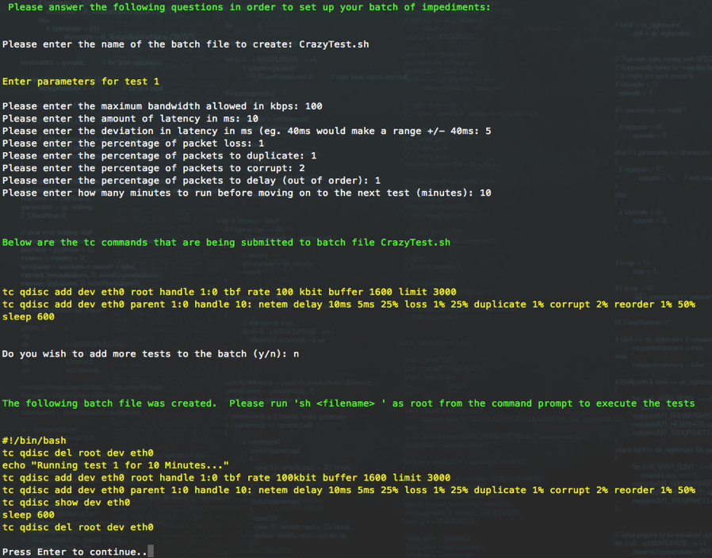

# tc_test
**Nectar Traffic Control (tc) Control Script for Microsoft**

I. Requirements
===============

1.  The tc\_test script is meant to run on any Centos or RHEL 6 and 7
    with a minimal install or greater.

2.  The script requires Python 2 and the bash shell. Both are installed
    by default during the minimal install.

3.  The user must have root access or have permissions to use sudo.

4.  Copy the script to one of the NUCs via SFTP or SCP. WinSCP is a
    great application to do this from a Windows machine. It can be place
    in /root (root user’s home directory.

5.  To start the script follow the steps below from the directory
    tcmenu.py is in.

    a.  Make the script executable:

        i.  *chmod 755 tcmenu.py *

    b.  Execute the script:

        i.  *./tcmenu.py*

II. Interface Choice
====================

{width="5.861111111111111in"
height="2.0277777777777777in"}

1.  When the script is executed the user will be prompted to select the
    interface that will be used for testing. This can be changed later
    if needed.

III. Top Level Menu
===================

{width="6.5in" height="2.861111111111111in"}

1.  Single Traffic Control Test – This allows the user to setup a single
    set of impediments that will run until cleared by the user. Setting
    up another Single Test will automatically clear the previous test.

2.  Batch Impediments – This allows the user to create a bash script
    that can be executed to run a series of times impediments. Once the
    script is created, it can be executed from the command line as root
    or with sudo by typing *sh &lt;filename&gt;.*

3.  Display Current Impediments – This will show the current state of
    the TC system.

4.  Clear all impediments – This will clear the TC system of
    all impediments.

5.  Change Interfaces – Change the interface that is being used
    for testing.

6.  Exit – Exits the script.

IV. Single Traffic Control Test
===============================

{width="6.0in" height="2.861111111111111in"}

The single traffic control test section will ask a series of questions
to gather information on how the impediments should be set up. Once all
the questions are answered it will produce the commands that are being
submitted for the users reference.

The impediments will continue to run until they are stopped through
tcmenu, a new single test is setup, or the script is exited through the
menu system. Exiting the script by using a &lt;ctrl&gt; &lt;c&gt; will
not clear the set impediments.

The user will be prompted for the following information:

-   Maximum bandwidth allowed in kbps – This is the maximum amount of
    outbound bandwidth available for the system to use.

-   Latency – The amount of delay before each packet hit the wire.

-   Deviation in latency – Randomly moves the latency setting + or –
    what is set here.

-   Packet loss percentage – The chance that a packet will be
    randomly dropped.

-   Packet duplication – The chance that a packet will be duplicated.

-   Packet corruption - The odds that a single bit error will be
    introduced at a random offset in the packet.

-   Percentage of Packets to delay – This sends out of order packets.
    The percentage entered here is the percentage of packets
    sent immediately. The rest will be delayed by the latency
    entry above.

V. Create Batch Traffic Control
===============================

{width="5.986111111111111in"
height="4.694444444444445in"}

The batch testing option creates a bash shell script with any number of
test scenarios included along with timers for how long they should run.
The shell script can then be executed outside of tcmenu or moved to
other machine for use there.

1.  The user must first enter a filename. This is the location where the
    script will be saved for future use.

2.  Next the user will be prompted with all the same questions as the
    Single Impediment mode (see section IV above).

3.  There will be one extra question, how long should the impediment
    stay in place (minutes). Once this timer expires, the current
    impediment will be cleared and the next impediment in the script
    will be used. If there are no more impediments, all impediments will
    be cleared and the script will exit.

4.  After setup the user will be shown the lines that were added to
    the script.

5.  Once all the impediments are entered, the user is shown the contents
    of the script file.

6.  To run the script follow the steps below from the directory where
    the script was saved.

    a.  Make the script executable:

        i.  *chmod 755 &lt;script name&gt;*

    b.  Execute the script:

        i.  *./&lt;scriptname&gt;*

VI. Display Impediments
=======================

This will display the current impediments. If there are no impediments
in place this will look something like this:

{width="5.986111111111111in"
height="1.5833333333333333in"}

If there are impediments in place it will look something like this:

{width="5.986111111111111in"
height="1.2083333333333333in"}

VII. Clear all impediments
==========================

This will clear all the currently running impediments. If there are
currently no impediments in place it will return the lines below. This
is perfectly normal.

{width="5.180555555555555in"
height="1.2638888888888888in"}

VIII. Change Interface
======================

This will take the user to the user selection menu from Section I,
Requirements.

IX Exit
=======

This will clean up any configured impediments and exit.
